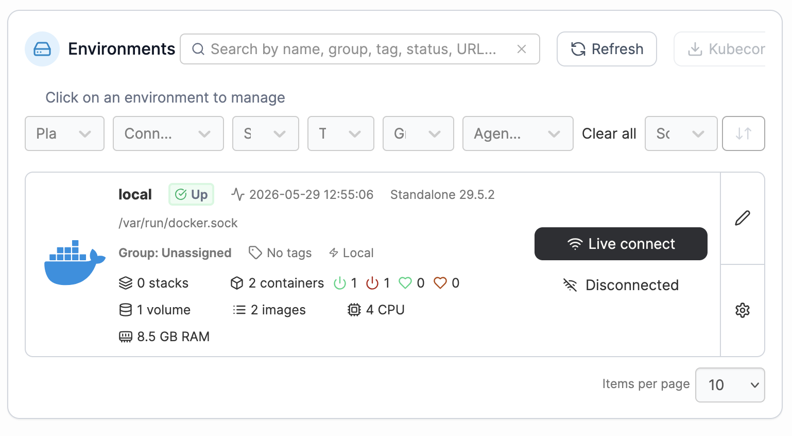

# Portainer einrichten

## Ziel

Portainer soll als Weboberfläche für Docker eingerichtet werden, damit Container, Images, Volumes und Netzwerke übersichtlich über den Browser angezeigt und verwaltet werden können.

---

## Durchführung

Zuerst wurde ein Docker-Volume für die Portainer-Daten erstellt:

```bash
docker volume create portainer_data
```

Danach wurde Portainer als Docker-Container gestartet:

```bash
docker run -d \
  -p 9443:9443 \
  --name portainer \
  --restart=always \
  -v /var/run/docker.sock:/var/run/docker.sock \
  -v portainer_data:/data \
  portainer/portainer-ce:lts
```

### Bedeutung der Parameter

* `-d`: startet den Container im Hintergrund
* `-p 9443:9443`: macht die Portainer-Weboberfläche im Heimnetz über Port `9443` erreichbar
* `--name portainer`: vergibt den Containernamen `portainer`
* `--restart=always`: startet Portainer nach einem Neustart automatisch wieder
* `-v /var/run/docker.sock:/var/run/docker.sock`: erlaubt Portainer den Zugriff auf die lokale Docker-Umgebung
* `-v portainer_data:/data`: speichert Portainer-Daten dauerhaft im Docker-Volume `portainer_data`
* `portainer/portainer-ce:lts`: verwendet die Community Edition von Portainer in der LTS-Version

Portainer wurde anschließend im Browser über die IP-Adresse des Raspberry Pi geöffnet:

```text
https://192.168.x.x:9443
```

---

## Hinweis zur Zertifikatswarnung

Beim ersten Öffnen zeigte Firefox eine Sicherheitswarnung an.

Grund dafür ist, dass Portainer lokal mit HTTPS läuft, aber kein offiziell signiertes Zertifikat verwendet. Da der Zugriff ausschließlich im Heimnetz über die lokale IP-Adresse erfolgt, wurde die Ausnahme akzeptiert.

---

## Ergebnis

Portainer wurde erfolgreich eingerichtet.

Das Dashboard zeigt die lokale Docker-Umgebung `local` als aktiv an. Die Umgebung wird über den Docker-Socket verwaltet:

```text
/var/run/docker.sock
```

Zum Zeitpunkt der Einrichtung wurden angezeigt:

* Umgebung: `local`
* Status: `Up`
* Docker Standalone
* 2 Container
* 2 Images
* 1 Volume
* 4 CPU
* ca. 8 GB RAM

Damit ist die Docker-Verwaltung über eine Weboberfläche möglich.

---

## Screenshot

Der folgende Screenshot zeigt das Portainer-Dashboard nach erfolgreicher Einrichtung. Die lokale Docker-Umgebung wird als aktiv angezeigt.



Hinweis: Die im Portainer-Dashboard angezeigte RAM-Größe kann leicht von der offiziellen Hardwareangabe abweichen. Ursache können Rundung, Umrechnung oder die Art der Systemanzeige sein. Der Raspberry Pi 500 wird in diesem Projekt als 8-GB-Modell dokumentiert.

---

## Erkenntnisse

* Portainer läuft selbst als Docker-Container.
* Das Volume `portainer_data` speichert die Portainer-Konfiguration dauerhaft.
* Über `/var/run/docker.sock` kann Portainer die lokale Docker-Umgebung verwalten.
* Der Zugriff erfolgt im Heimnetz über Port `9443`.
* Eine Browser-Warnung kann bei lokalem HTTPS ohne offizielles Zertifikat normal sein.
