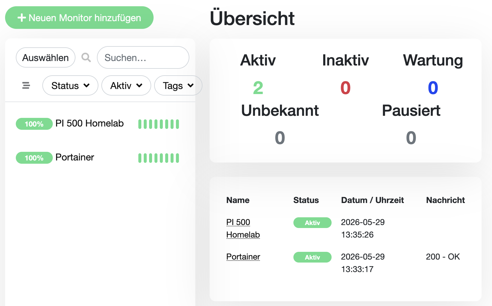

# Uptime Kuma einrichten

## Ziel

Uptime Kuma soll als Monitoring-Dienst im Homelab eingerichtet werden, um die Erreichbarkeit wichtiger Dienste zu überwachen.

Im ersten Schritt werden der Raspberry Pi 500 selbst und Portainer überwacht.

---

## Durchführung

Uptime Kuma wurde als Docker-Container auf dem Raspberry Pi 500 gestartet:

```bash
docker run -d \
  --restart=always \
  -p 3001:3001 \
  -v uptime-kuma:/app/data \
  --name uptime-kuma \
  louislam/uptime-kuma:1
```

### Bedeutung der Parameter

* `-d`: startet den Container im Hintergrund
* `--restart=always`: startet den Container nach einem Neustart automatisch wieder
* `-p 3001:3001`: macht die Weboberfläche im Heimnetz erreichbar
* `-v uptime-kuma:/app/data`: speichert die Konfiguration dauerhaft in einem Docker-Volume
* `--name uptime-kuma`: vergibt einen eindeutigen Containernamen

---

## Zugriff auf die Weboberfläche

Uptime Kuma wurde im Browser geöffnet über:

```text
http://192.168.x.x:3001
```

Anschließend wurde ein Admin-Benutzer eingerichtet.

---

## Eingerichtete Monitore

### Portainer

Portainer wird per HTTP(s)-Monitor überwacht:

```text
Name: Portainer
Typ: HTTP(s)
URL: https://192.168.x.x:9443
```

Da Portainer im Heimnetz mit einem selbstsignierten Zertifikat läuft, wurde die Option zum Ignorieren von TLS-/SSL-Fehlern aktiviert.

### Raspberry Pi 500

Der Raspberry Pi 500 wird per Ping-Monitor überwacht:

```text
Name: Raspberry Pi 500
Typ: Ping
Host: 192.168.x.x
```

---

## Ergebnis

Uptime Kuma läuft erfolgreich als Docker-Container.

Die ersten Monitore wurden eingerichtet und zeigen den Status der überwachten Dienste an:

* Raspberry Pi 500 erreichbar
* Portainer erreichbar

Damit ist eine einfache Monitoring-Grundlage für das Homelab vorhanden.

---

## Screenshot

Der folgende Screenshot zeigt das Uptime-Kuma-Dashboard mit den eingerichteten Monitoren für das Homelab.



---

## Erkenntnisse

* Uptime Kuma dient zur Überwachung von Diensten und Geräten im Heimnetz.
* Monitoring hilft dabei, Ausfälle schneller zu erkennen.
* Container können über Docker dauerhaft mit Volumes und automatischem Neustart betrieben werden.
* Selbstsignierte Zertifikate können bei lokalen Diensten zu Warnungen führen.
* Durch Monitoring wird aus einer reinen Installation eine kleine betreibbare Umgebung.

---

## Hinweis zu verfügbaren Updates

Nach der Einrichtung zeigte Uptime Kuma an, dass eine Aktualisierung verfügbar ist.

Die Aktualisierung wurde zunächst nicht durchgeführt, da Uptime Kuma aktuell funktioniert und Updates bei Docker-Containern bewusst geplant werden sollten.

Vor einer späteren Aktualisierung sollen zuerst die bestehenden Daten gesichert und anschließend der Container kontrolliert neu erstellt werden.

---

## Hinweis zur Erweiterung

Die erste Monitoring-Grundlage umfasst den Raspberry Pi 500 und Portainer.

Die spätere Erweiterung um Adminer und PostgreSQL wird in `docs/05-postgresql-adminer.md` dokumentiert.

