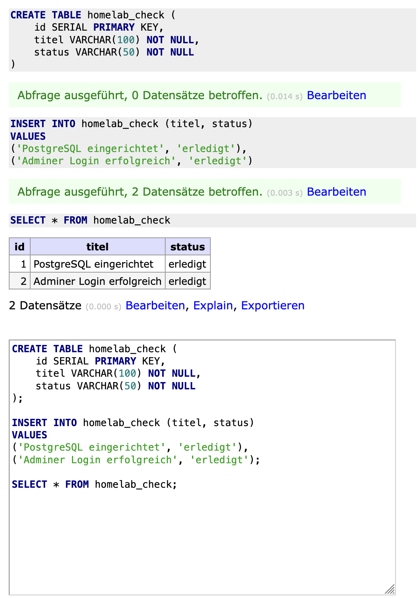
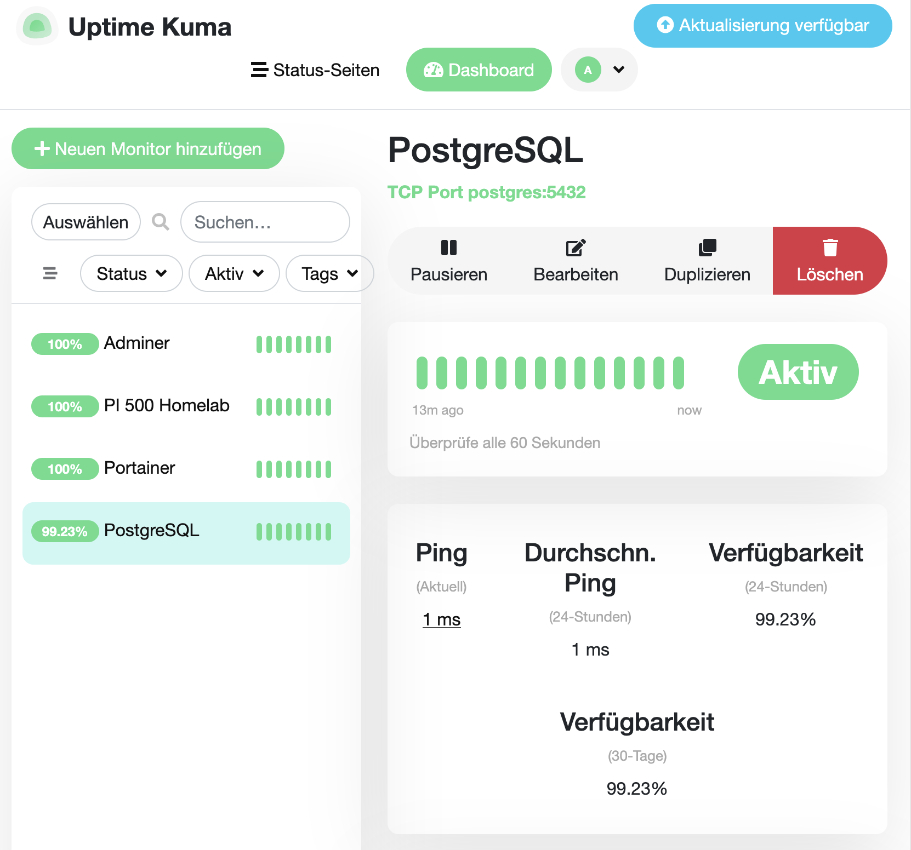

# PostgreSQL und Adminer einrichten

## Ziel

PostgreSQL soll als Datenbankdienst im Homelab eingerichtet werden. Adminer dient als einfache Weboberfläche, um die Datenbank im Browser zu verwalten und die Verbindung zu testen.

Dieser Schritt bildet die Grundlage, um später eigene Anwendungen mit einem externen Datenbankdienst verbinden zu können.

---

## Docker-Netzwerk erstellen

Damit PostgreSQL, Adminer und später weitere Dienste intern miteinander kommunizieren können, wurde ein eigenes Docker-Netzwerk erstellt.

```bash
docker network create homelab-net
```

### Bedeutung des Befehls

* `docker network create`: erstellt ein neues Docker-Netzwerk
* `homelab-net`: Name des Netzwerks für interne Homelab-Dienste

### Ergebnis

Das Netzwerk `homelab-net` dient als internes Docker-Netzwerk für Dienste, die miteinander kommunizieren sollen.

Container im gleichen Docker-Netzwerk können sich gegenseitig über ihre Containernamen erreichen.

---

## PostgreSQL-Container starten

PostgreSQL wurde als Docker-Container gestartet.

```bash
docker run -d \
  --name postgres \
  --restart=always \
  --network homelab-net \
  -e POSTGRES_USER=homelab \
  -e POSTGRES_PASSWORD=<starkes-passwort> \
  -e POSTGRES_DB=homelab_db \
  -v postgres_data:/var/lib/postgresql/data \
  postgres:16
```

### Bedeutung der Parameter

* `-d`: startet den Container im Hintergrund
* `--name postgres`: vergibt den Containernamen `postgres`
* `--restart=always`: startet den Container nach einem Neustart automatisch
* `--network homelab-net`: verbindet PostgreSQL mit dem internen Docker-Netzwerk
* `POSTGRES_USER=homelab`: legt den Datenbankbenutzer fest
* `POSTGRES_PASSWORD=<starkes-passwort>`: setzt das Datenbankpasswort
* `POSTGRES_DB=homelab_db`: erstellt eine erste Datenbank
* `postgres_data:/var/lib/postgresql/data`: speichert die Daten dauerhaft in einem Docker-Volume
* `postgres:16`: verwendet PostgreSQL Version 16

Das echte Passwort wird nicht in der Projektdokumentation gespeichert.

---

## Adminer-Container starten

Adminer wurde als Weboberfläche zur Datenbankverwaltung eingerichtet.

```bash
docker run -d \
  --name adminer \
  --restart=always \
  --network homelab-net \
  -p 8080:8080 \
  adminer
```

### Bedeutung der Parameter

* `-d`: startet den Container im Hintergrund
* `--name adminer`: vergibt den Containernamen `adminer`
* `--restart=always`: startet Adminer nach einem Neustart automatisch
* `--network homelab-net`: verbindet Adminer mit dem gleichen internen Netzwerk wie PostgreSQL
* `-p 8080:8080`: macht Adminer im Heimnetz über Port `8080` erreichbar
* `adminer`: verwendet das Adminer-Image

---

## Zugriff auf Adminer

Adminer wurde im Browser geöffnet über:

```text
http://192.168.x.x:8080
```

Die Anmeldung erfolgte mit folgenden Werten:

```text
System: PostgreSQL
Server: postgres
Username: homelab
Password: <starkes-passwort>
Database: homelab_db
```

Bei `Server` wurde `postgres` verwendet, weil Adminer und PostgreSQL im gleichen Docker-Netzwerk `homelab-net` laufen und sich dort über den Containernamen erreichen können.

---

## Funktionstest

Zum Test wurde in Adminer ein SQL-Befehl ausgeführt.

```sql
CREATE TABLE homelab_check (
    id SERIAL PRIMARY KEY,
    titel VARCHAR(100) NOT NULL,
    status VARCHAR(50) NOT NULL
);

INSERT INTO homelab_check (titel, status)
VALUES
('PostgreSQL eingerichtet', 'erledigt'),
('Adminer Login erfolgreich', 'erledigt');

SELECT * FROM homelab_check;
```

Der SQL-Test erstellt eine einfache Prüftabelle, fügt zwei Testdatensätze ein und liest diese anschließend wieder aus. Damit wird geprüft, ob PostgreSQL Daten speichern und über Adminer anzeigen kann.

### Ergebnis

Die Tabelle `homelab_check` wurde erfolgreich erstellt.

Die eingefügten Datensätze konnten anschließend per `SELECT` abgefragt werden.

Damit wurde bestätigt:

* PostgreSQL läuft als Datenbankdienst
* Adminer kann auf PostgreSQL zugreifen
* Benutzer, Passwort und Datenbank funktionieren
* Daten können gespeichert und abgefragt werden

---

## Screenshot

Der folgende Screenshot zeigt den erfolgreichen Zugriff auf PostgreSQL über Adminer sowie die ausgeführte Testabfrage.



---

## Monitoring mit Uptime Kuma

Adminer und PostgreSQL wurden zusätzlich in Uptime Kuma aufgenommen.

### Adminer-Monitor

Adminer wird über die Weboberfläche geprüft.

```text
Typ: HTTP(s)
URL: http://192.168.x.x:8080
```

Dieser Monitor prüft, ob die Adminer-Weboberfläche im Heimnetz erreichbar ist.

### PostgreSQL-Monitor

PostgreSQL wird intern über einen TCP-Port-Monitor geprüft.

```text
Typ: TCP Port
Hostname: postgres
Port: 5432
```

PostgreSQL wurde nicht über einen Host-Port veröffentlicht, sondern läuft intern im Docker-Netzwerk `homelab-net`.

Damit Uptime Kuma PostgreSQL intern überwachen konnte, musste der bereits vorhandene Uptime-Kuma-Container zusätzlich mit dem Docker-Netzwerk `homelab-net` verbunden werden.

---

## Probleme und Lösungen

### Problem: PostgreSQL war für Uptime Kuma zunächst nicht intern erreichbar

Der bereits eingerichtete Uptime-Kuma-Container konnte PostgreSQL zunächst nicht über den Containernamen `postgres` erreichen.

### Ursache

Uptime Kuma befand sich zu diesem Zeitpunkt noch nicht im gleichen Docker-Netzwerk wie PostgreSQL.

Container können sich über ihre Containernamen nur dann zuverlässig erreichen, wenn sie sich im gleichen Docker-Netzwerk befinden.

### Lösung

Der bereits vorhandene Uptime-Kuma-Container wurde nachträglich mit dem Docker-Netzwerk `homelab-net` verbunden:

```bash
docker network connect homelab-net uptime-kuma
```

### Bedeutung des Befehls

* `docker network connect`: verbindet einen bestehenden Container mit einem Docker-Netzwerk
* `homelab-net`: Docker-Netzwerk, in dem PostgreSQL läuft
* `uptime-kuma`: bereits laufender Uptime-Kuma-Container

Danach konnte Uptime Kuma PostgreSQL intern über den Containernamen `postgres` und Port `5432` überwachen.

---

## Ergebnis

Adminer und PostgreSQL werden in Uptime Kuma als erreichbar angezeigt.

Damit werden neben dem Raspberry Pi 500 und Portainer nun auch die Datenbankverwaltung und der Datenbankdienst überwacht.

---

## Screenshot

Der folgende Screenshot zeigt die erfolgreiche Einbindung von PostgreSQL und Adminer in Uptime Kuma.



---

## Sicherheitshinweis

Die eingerichteten Dienste laufen aktuell nur im lokalen Heimnetz.

In der FRITZ!Box sind keine Portfreigaben für den Raspberry Pi 500 eingerichtet. Damit sind Portainer, Uptime Kuma, Adminer und PostgreSQL nicht direkt aus dem Internet erreichbar.

PostgreSQL wurde nicht über einen Host-Port veröffentlicht, sondern läuft intern im Docker-Netzwerk `homelab-net`.

Das echte PostgreSQL-Passwort wird nicht in der Projektdokumentation gespeichert.

In der Testdatenbank werden keine echten privaten Daten gespeichert.

---

## Erkenntnisse

* PostgreSQL ist ein Datenbankserver und läuft als eigener Dienst.
* Adminer ist eine Weboberfläche zur Verwaltung von Datenbanken.
* PostgreSQL und Adminer sind getrennte Dienste, die separat als Container laufen.
* Container können über ein gemeinsames Docker-Netzwerk miteinander kommunizieren.
* Ein Docker-Volume sorgt dafür, dass Daten auch nach einem Container-Neustart erhalten bleiben.
* Uptime Kuma kann neben Webseiten auch TCP-Ports überwachen.
* Dienste im Homelab sind nicht automatisch aus dem Internet erreichbar, solange keine Portfreigaben eingerichtet sind.
* Für spätere Anwendungsentwicklung kann eine eigene Java-Anwendung mit einem externen Datenbankdienst verbunden werden.