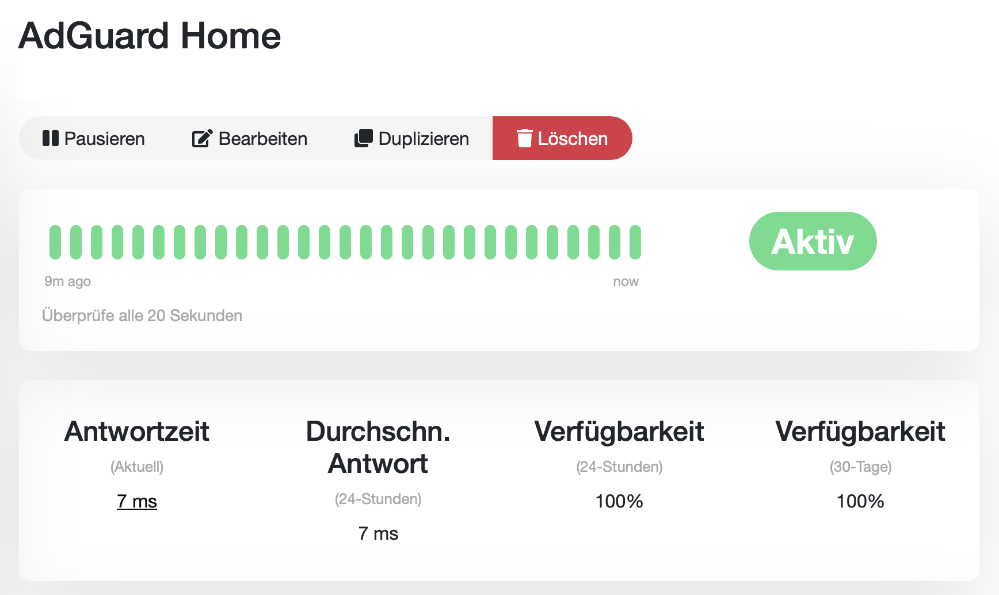
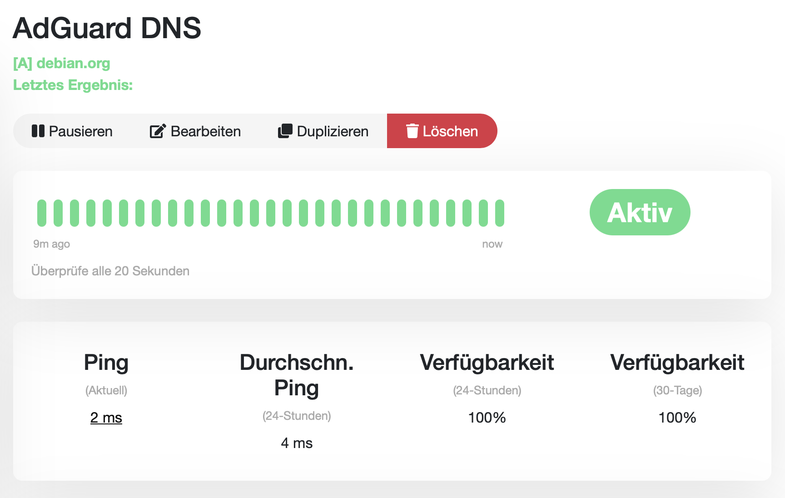

# AdGuard Home als DNS-Filter im Heimnetz

## Projektziel

Nach der erfolgreichen Migration des Homelabs auf den neuen Homeserver soll das Heimnetz um einen zentralen DNS-Filter erweitert werden.

Dafür wird AdGuard Home als eigener Docker-Dienst auf dem Homeserver vorbereitet.

Ziel ist es, DNS-Anfragen im Heimnetz später zentral über AdGuard Home zu leiten und dabei Werbung, Tracking- und unerwünschte Domains bereits auf DNS-Ebene filtern zu können.

Die Umstellung des Heimnetzes erfolgt bewusst schrittweise. Zunächst wird AdGuard Home installiert, eingerichtet und überwacht. Die spätere DNS-Integration über die FRITZ!Box erfolgt separat.

---

## Ausgangssituation

Der Homeserver läuft auf Debian Server minimal und stellt bereits mehrere Homelab-Dienste im lokalen Heimnetz bereit.

Vorhandene Dienste:

* Portainer
* Uptime Kuma
* PostgreSQL
* Adminer
* Cockpit

AdGuard Home ist kein migrierter Dienst vom Raspberry Pi 500, sondern ein neuer Netzwerkdienst nach Abschluss der Homeserver-Migration.

Deshalb wird AdGuard Home nicht in den bestehenden Compose-Stack `~/docker/homelab` integriert, sondern als eigener Docker-Compose-Stack eingerichtet.

---

## Entscheidung für einen eigenen Compose-Stack

AdGuard Home wurde bewusst in einem eigenen Compose-Verzeichnis eingerichtet:

```text
~/docker/adguard-home
```

Dadurch bleibt der bestehende Homelab-Stack getrennt von einem neuen Netzwerkdienst.

Diese Trennung ist sinnvoll, weil AdGuard Home eine andere Aufgabe übernimmt als die bisherigen Dienste.

Die bisherigen Dienste sind primär Anwendungen und Verwaltungsoberflächen. AdGuard Home arbeitet dagegen als DNS-Dienst und kann später Einfluss auf die Namensauflösung im gesamten Heimnetz haben.

Vorteile der getrennten Struktur:

* klare Trennung zwischen Migration und neuem Ausbau
* eigene Konfiguration für AdGuard Home
* einfachere Wartung
* nachvollziehbare Dokumentation
* geringeres Risiko bei Änderungen am bestehenden Homelab-Stack

---

## Funktion von AdGuard Home

AdGuard Home ist ein DNS-basierter Filterdienst.

Wenn ein Gerät im Heimnetz eine Domain auflösen möchte, kann diese Anfrage später über AdGuard Home geleitet werden.

AdGuard Home prüft die angefragte Domain anhand von Filterlisten.

Wird eine Domain als Werbung, Tracking oder unerwünscht erkannt, kann die DNS-Anfrage blockiert werden.

Vereinfacht:

```text
Client fragt: ads.example.com
AdGuard Home prüft die Domain
AdGuard Home blockiert die Anfrage
Der Werbe- oder Trackingserver wird nicht erreicht
```

Damit wirkt AdGuard Home netzwerkweit und nicht nur in einem einzelnen Browser.

---

## Grenzen von DNS-Filterung

AdGuard Home ersetzt keinen vollständigen Browser-Adblocker.

DNS-Filterung funktioniert gut bei separaten Werbe-, Tracking- und Telemetrie-Domains.

DNS-Filterung ist weniger wirksam, wenn Werbung über dieselbe Domain ausgeliefert wird wie der eigentliche Inhalt.

Daher können bestimmte Werbeformen weiterhin sichtbar bleiben, zum Beispiel:

* YouTube-Werbung
* Werbung in sozialen Netzwerken
* Werbung aus derselben Domain wie der eigentliche Inhalt
* Inhalte, die nicht eindeutig über DNS getrennt werden können

AdGuard Home ist daher als zentrale Ergänzung zu verstehen, nicht als vollständiger Ersatz für Browser-Erweiterungen.

---

## Vorbereitung

Für AdGuard Home wurde ein eigener Arbeitsordner angelegt:

```bash
mkdir -p ~/docker/adguard-home
cd ~/docker/adguard-home
```

Vor dem Start wurde geprüft, ob die benötigten Ports frei sind.

```bash
sudo ss -tulpn | grep -E ':53|:3000|:8081'
```

Relevante Ports:

```text
53   = DNS
3000 = Ersteinrichtung
8081 = Weboberfläche auf dem Host
```

Port `8080` wurde bewusst nicht verwendet, da dieser bereits für Adminer genutzt wird.

---

## Docker-Compose-Konfiguration

Die Datei `docker-compose.yml` wurde im Verzeichnis `~/docker/adguard-home` erstellt.

```yaml
services:
  adguard-home:
    image: adguard/adguardhome:latest
    container_name: adguard-home
    restart: unless-stopped
    ports:
      - "53:53/tcp"
      - "53:53/udp"
      - "3000:3000/tcp"
      - "8081:80/tcp"
    volumes:
      - ./work:/opt/adguardhome/work
      - ./conf:/opt/adguardhome/conf
```

Die Verzeichnisse `work` und `conf` werden lokal im Compose-Ordner gespeichert.

Dadurch bleiben Konfiguration und Arbeitsdaten von AdGuard Home auch nach einem Neustart oder Container-Update erhalten.

---

## Compose-Konfiguration prüfen

Vor dem Start wurde die Compose-Datei geprüft:

```bash
docker compose config --quiet
```

Wenn dieser Befehl keine Ausgabe erzeugt, ist die Compose-Konfiguration syntaktisch gültig.

---

## Container starten

AdGuard Home wurde anschließend gestartet:

```bash
docker compose up -d
```

Der laufende Container wurde geprüft mit:

```bash
docker ps
```

Erwarteter Container:

```text
adguard-home
```

---

## Ersteinrichtung

Die Ersteinrichtung wurde im Browser über Port `3000` geöffnet:

```text
http://192.168.x.x:3000
```

Während der Einrichtung wurden folgende Ports verwendet:

```text
Admin-Weboberfläche: Port 80 im Container
DNS-Server: Port 53
```

Da der Container-Port `80` auf dem Host-Port `8081` veröffentlicht wurde, ist die Weboberfläche nach der Einrichtung erreichbar unter:

```text
http://192.168.x.x:8081
```

Für die Weboberfläche wurde ein eigener AdGuard-Admin-Benutzer angelegt.

Das Passwort wird nicht in der Projektdokumentation gespeichert.

---

## Docker- und Netzwerkadressen

Während der Einrichtung zeigte AdGuard Home interne Adressen wie:

```text
127.0.0.1
172.x.x.x
::1
```

Diese Adressen gehören zum Container beziehungsweise zum Docker-Netzwerk.

Für die spätere Einbindung ins Heimnetz ist nicht die interne Docker-Adresse relevant, sondern die lokale IP-Adresse des Homeservers.

Wichtig für die spätere FRITZ!Box-Konfiguration ist:

```text
DNS-Server: lokale IP-Adresse des Homeservers
Port: 53
```

Die interne Docker-IP wird nicht als feste Adresse in der FRITZ!Box verwendet.

---

## Erreichbarkeit der Weboberfläche

Nach Abschluss der Ersteinrichtung wurde geprüft, ob die AdGuard-Home-Weboberfläche erreichbar ist.

```text
http://192.168.x.x:8081
```

Die Weboberfläche konnte erfolgreich geöffnet werden.

Damit ist AdGuard Home als Dienst auf dem Homeserver vorbereitet.

---

## Monitoring mit Uptime Kuma

AdGuard Home wurde zusätzlich in Uptime Kuma aufgenommen.

Dabei wurden zwei Monitore eingerichtet:

* HTTP-Monitor für die AdGuard-Home-Weboberfläche
* DNS-Monitor für die DNS-Funktion von AdGuard Home

Der HTTP-Monitor prüft, ob die Weboberfläche erreichbar ist:

```text
http://192.168.x.x:8081
```

Der DNS-Monitor prüft, ob AdGuard Home DNS-Anfragen über Port `53` annimmt und korrekt beantwortet.

Als Testdomain wurde bewusst `debian.org` verwendet.

Beispielhafte DNS-Monitor-Konfiguration:

```text
Monitor Type: DNS
Friendly Name: AdGuard DNS
Hostname: debian.org
Resolver Server: 192.168.x.x
Resolver Port: 53
Resource Record Type: A
```

Damit wird nicht nur geprüft, ob der Container läuft, sondern auch, ob der DNS-Dienst selbst erreichbar ist.



)

---

## Aktueller Stand

AdGuard Home ist installiert, eingerichtet und lokal erreichbar.

Die Weboberfläche ist über den Homeserver erreichbar.

Die DNS-Funktion wurde über Uptime Kuma geprüft.

Alle eingerichteten Uptime-Kuma-Monitore für AdGuard Home zeigen einen fehlerfreien Zustand.

Die FRITZ!Box wurde noch nicht auf AdGuard Home als zentralen DNS-Server umgestellt.

Damit bleibt das Heimnetz unverändert funktionsfähig, während AdGuard Home bereits vorbereitet und getestet ist.

---

## Geplante Netzwerkintegration

Die Integration in das Heimnetz erfolgt später über die FRITZ!Box.

Geplant ist, die lokale IP-Adresse des Homeservers als DNS-Server im Heimnetz zu verwenden.

Dadurch sollen Geräte im Heimnetz ihre DNS-Anfragen zentral an AdGuard Home senden.

Vor der Umstellung sind folgende Punkte wichtig:

* aktuelle DNS-Einstellungen der FRITZ!Box prüfen
* lokale IP-Adresse des Homeservers bestätigen
* AdGuard Home muss erreichbar sein
* Uptime-Kuma-Monitore sollten grün sein
* Rollback-Möglichkeit kennen

Rollback bedeutet:

```text
DNS-Einstellung in der FRITZ!Box wieder auf die vorherige Einstellung zurücksetzen
```

Die Netzwerkintegration wird bewusst getrennt von der Installation durchgeführt, um Fehler bei der Namensauflösung im Heimnetz kontrolliert behandeln zu können.

---

## Sicherheit und Datenschutz

AdGuard Home läuft im lokalen Heimnetz auf dem Homeserver.

Die Weboberfläche ist nicht über eine Portfreigabe aus dem Internet erreichbar.

Es wurden keine Zugangsdaten in der Dokumentation gespeichert.

Die AdGuard-Konfiguration liegt lokal im Verzeichnis:

```text
~/docker/adguard-home/conf
```

Die Arbeitsdaten liegen lokal im Verzeichnis:

```text
~/docker/adguard-home/work
```

Damit bleibt die Konfiguration nachvollziehbar und unabhängig vom Container selbst erhalten.

---

## Ergebnis

AdGuard Home wurde erfolgreich als eigener Docker-Compose-Dienst auf dem Homeserver eingerichtet.

Der Dienst ist lokal erreichbar und wurde in Uptime Kuma aufgenommen.

Die Weboberfläche und die DNS-Funktion werden überwacht.

Die spätere Einbindung in die FRITZ!Box wurde bewusst noch nicht durchgeführt, damit die Netzwerkintegration kontrolliert und separat erfolgen kann.

Damit ist AdGuard Home technisch vorbereitet und kann im nächsten Schritt als zentraler DNS-Filter für das Heimnetz genutzt werden.

---

## Erkenntnisse

* AdGuard Home eignet sich als sinnvoller zusätzlicher Homelab-Dienst nach der Migration.
* Ein eigener Compose-Stack trennt den neuen DNS-Dienst sauber vom bestehenden Homelab-Stack.
* DNS-Filterung wirkt netzwerkweit, ersetzt aber keinen vollständigen Browser-Adblocker.
* Die interne Docker-IP ist nicht die Adresse, die später in der FRITZ!Box verwendet wird.
* Für das Heimnetz ist die lokale IP-Adresse des Homeservers relevant.
* Uptime Kuma kann sowohl die Weboberfläche als auch die DNS-Funktion von AdGuard Home überwachen.
* Die DNS-Umstellung sollte kontrolliert erfolgen, da sie Auswirkungen auf die Namensauflösung im Heimnetz hat.